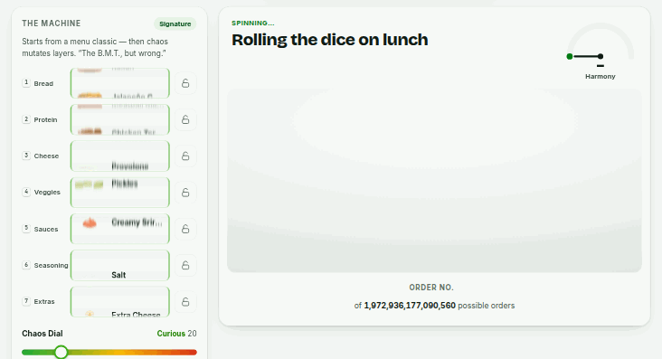
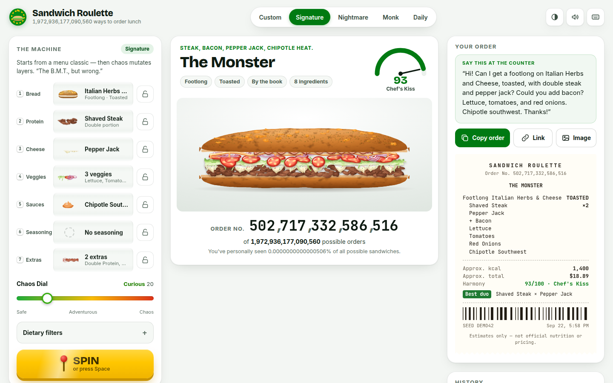
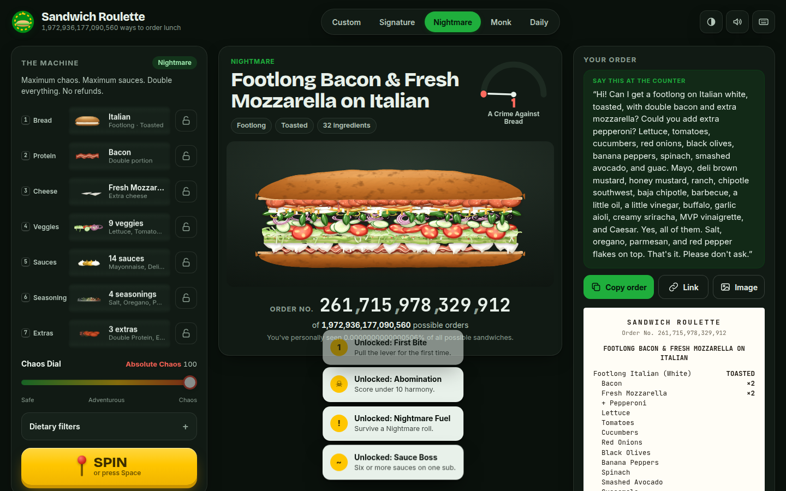
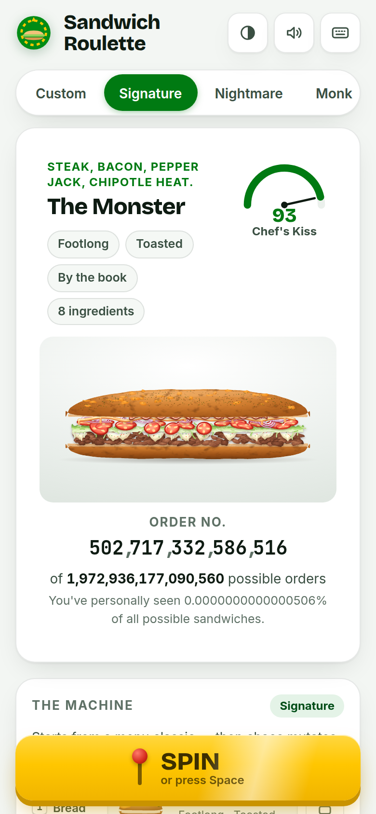

# 🥪 Sandwich Roulette

**A slot machine for your sub order.** Pull the lever, watch seven reels spin, and see a photoreal sandwich build itself layer by layer. Then read a counter-ready order out loud. Every roll is one of **1,972,936,177,090,560** possible orders, and the app tells you exactly which one.

<p align="center"></p>

| Light | Nightmare mode, dark | Phone |
|---|---|---|
|  |  |  |

> Independent fan project. **Not affiliated with, endorsed by, or sponsored by Subway IP LLC.** All artwork is original and procedurally generated. Menu names are used descriptively, and nutrition and prices are rough estimates.

---

## What it does

- **Seven reels:** bread (plus size and toast), protein, cheese, veggies, sauces, seasoning, and extras. They spin with per-reel directional motion blur and stop left to right with a snap.
- **The sandwich builds itself.** As each reel lands, its icon flies to the stage and that layer drops in on a spring. Sauces pour on, the lid slams down, and then it **toasts** with a heat shimmer while the cheese melts.
- **The Chaos Dial (0–100):** at 0 it picks popular combos and favors pairings that go together. At 100 every ingredient is equally likely, so tuna + BBQ + feta is on the table.
- **A harmony score.** A flavor-pairing matrix rates every roll from *Chef's Kiss* down to *A Crime Against Bread*. Great rolls get lettuce confetti; cursed ones shake the screen.
- **A counter script** you can actually say out loud:
  > "Hi! Can I get a footlong on Italian Herbs and Cheese, toasted, with double steak and pepper jack? Could you add bacon? Lettuce, tomatoes, and red onions. Chipotle southwest. Thanks!"
- **Five modes:** Custom · Signature (a menu classic, then chaos mutates layers: "The B.M.T., but wrong") · Nightmare · Monk · Daily (everyone gets the same sub each day).
- **Locks:** hold any reel and re-roll the rest.
- **Dietary filters:** vegetarian, vegan, pescatarian, no pork, no beef, dairy-free, gluten-free, no heat.
- **Share links replay the exact spin.** You can also export a 1200×630 share image, and a thermal receipt shows approximate kcal and price.
- **History** with a Hall of Fame and a Hall of Shame, plus **20 badges**.
- **Synthesized sound.** Every effect is generated live with WebAudio; there are no audio files.
- **Keyboard:** `Space` spins, or skips to the result mid-spin · `1`–`7` lock reels · `←`/`→` chaos · `C` copy · `S` share · `T` toast · `M` mute · `?` help.

## The math

The total is computed live with `BigInt` from the dataset, using the same menu rules the randomizer follows (a bowl can't be toasted, "double protein" needs a protein, and so on):

```
breads   7 subs × (2 sizes × 2 toast) + 1 bowl                       =        29
proteins 1 none×4 + bacon×4 + pepperoni×4 + 15 others×8               =       132
         (double protein / add bacon / add pepperoni where allowed)
cheeses  1 none + 7 × (with / without extra cheese)                   =        15
subsets  2^(12 veggies + 18 sauces + 5 seasonings)                    = 34,359,738,368
                                                        total = 1,972,936,177,090,560
```

`orderRank()` maps every valid order to a unique serial number (a bijection over that whole space), which is the **Order No.** on each roll. Turn on the Vegan filter and the space shrinks to 285,212,672.

## Where the art comes from (the "1:1 look")

Subway's photos and logo belong to Subway, and this environment can't reach their site anyway, so **none of their assets are used.** The look comes from three things instead:

1. **Procedural "photoreal" SVG.** Every ingredient is drawn by code with SVG filters: diffuse-lit fractal noise for the crust and crumb, specular highlights for wet tomatoes and pickles, displacement for organic lettuce edges, contact shadows, and an animatable toast filter with char mottling. Each roll's seed jitters the geometry, so no two lettuce leaves match.
2. **Brand language, not brand assets:** a green-and-gold palette, a card-tile builder, and a clean product-shot stage.
3. **Local photo mode** (optional; your images stay on your machine):
   ```bash
   # name files by ingredient id — see the list printed by the ingest command
   cp ~/Pictures/tomato.jpg assets/custom/tomato.jpg
   npm run assets:ingest   # shows matches, flags typos ("did you mean 'tomato'?")
   npm run dev             # matched ingredients now render as photos
   ```
   `assets/custom/` is gitignored, so photos you add there never get committed.

## Stack

Vanilla TypeScript + Vite. **Zero runtime dependencies**, and the app makes **zero network requests** at runtime; fonts are self-hosted. The production bundle is about 41 KB of JS gzipped, and a typical first visit loads roughly 180 KB including fonts.

```
src/
  data/       ingredients (8 breads, 18 proteins, 8 cheeses, 12 veggies, 18 sauces, 5 seasonings, 4 extras),
              16 signature builds, flavor-pairing matrix
  engine/     seeded sfc32 RNG · chaos-dial randomizer · filters · BigInt combinatorics + orderRank
              · harmony scoring · counter script + share codec
  render/     SVG filter library · per-ingredient renderers · sandwich compositor · photo drop-in
  ui/         reels · stage choreography · odometer · gauge · receipt · share card · history · badges
  audio/      WebAudio synth
```

## Develop

```bash
npm install
npm run dev          # http://localhost:5173 — and /lab.html for the render lab (every bread/protein/signature)
npm test             # 20 unit/property tests (incl. a 10k-seed dietary-filter property test)
npm run typecheck && npm run lint
npm run build && npm run preview
npm run e2e -- http://localhost:4173/   # 20 end-to-end checks in headless Chromium (needs a running server)
```

The e2e suite covers: slam-to-result, reel locks, share-link replay, all five modes, the vegan filter in the live app, PNG export, clipboard, reduced motion, 390px layout with no horizontal overflow, and **zero external requests**. Lighthouse on the production build scores **mobile 96 / 100 / 100 / 100** and **desktop 100 / 100 / 100 / 100** (Performance / Accessibility / Best Practices / SEO).

## Deploy

`.github/workflows/deploy.yml` publishes to GitHub Pages on every push to `main`. To enable it, go to **Settings → Pages → Source: GitHub Actions**. CI (`ci.yml`) runs typecheck, lint, tests, and a build on every push and PR.

## Accessibility

- Honors `prefers-reduced-motion` with a complete non-animated path, and the app stays fully usable.
- A live region announces the finished order.
- Every control works from the keyboard and has a visible focus ring.
- Color contrast meets WCAG AA in both themes. Verdicts appear as text, never as color alone.

## Credits

Design brief: [`PLAN.md`](PLAN.md). Licensed [MIT](LICENSE).
